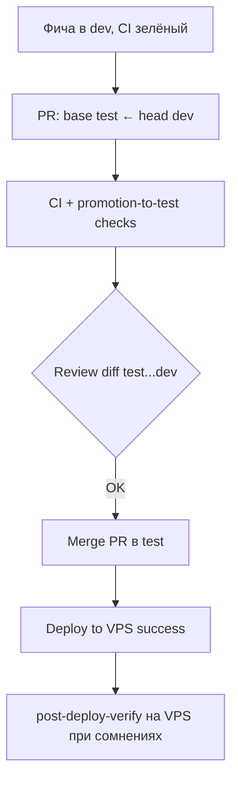

# Политика слияния `dev` → `test` (деплойная ветка)

## Роли веток

| Ветка | Назначение | Деплой на VPS |
|-------|------------|---------------|
| **`dev`** | Интеграция фич, эксперименты, compose-dev | нет |
| **`test`** | **Единственная** прод-подобная ветка для `/opt/acome-offer-desk` | да (`Deploy to VPS` на push) |

**Канон:** `alexonderia/AcomOfferDesk`. Форк `vvv-web` — для PR и зеркала; на VPS `git reset --hard upstream/test`.

## Золотые правила

1. **В `test` не коммитить фичи напрямую** — только перенос из `dev` через PR (или осознанный fast-forward после зелёного CI).
2. **Слияние только `dev` → `test`**, не наоборот для релиза на VPS.
3. **После merge в `test`** — дождаться зелёного **CI + Deploy to VPS** перед объявлением «прод обновлён».
4. **Не выравнивать ветки «вслепую»** (`merge dev` без просмотра diff) — смотреть `docker-compose*.yml`, `backend/.env.example`, Keycloak, deploy workflow.
5. **Секреты и VPS-only файлы** (`backend/.env` на сервере) **не** попадают в git; merge не должен требовать ручных правок на VPS в отслеживаемых файлах.

## Рекомендуемый процесс (каждый релиз на test)



### Шаги

1. Убедиться, что **`dev` зелёный** (workflow **CI** на последнем коммите).
2. Открыть **PR: base `test` ← compare `dev`** (в GitHub alexonderia или через форк → upstream).
3. Дождаться job **`Promotion to test`** + **CI** (обязательные checks).
4. Просмотреть diff, особенно:
   - `docker-compose.yml`, `docker-compose.prod.yml`, `docker-compose.test.yml`
   - `.github/workflows/deploy.yml`
   - `infra/keycloak/*`, `backend/app/core/config.py`
   - `backend/app/services/keycloak_admin.py`
5. **Merge** (предпочтительно **Create a merge commit** или **Squash** по договорённости команды; **fast-forward** допустим, если `test` — прямой предок `dev` и нет расхождения истории).
6. Дождаться **Deploy to VPS** на коммите `test`.
7. При изменениях IAM/Keycloak — `./scripts/post-deploy-verify.sh` на VPS (см. `docs/operations/environments.md`).

### Локально перед PR

```bash
git fetch upstream
git checkout dev && git pull upstream dev
./scripts/verify-promotion-to-test.sh
git log --oneline upstream/test..upstream/dev   # что уедет на прод
git diff upstream/test...upstream/dev -- docker-compose.yml .github/workflows/deploy.yml
```

### Одна команда (рекомендуется)

Скрипт **`scripts/promote-dev-to-test.sh`** выполняет весь фильтр: локальные проверки → зелёный CI на `dev` → PR `dev` → `test` → ожидание **CI** + **Promotion to test** → опционально merge.

```bash
# Проверки + PR + дождаться зелёных checks (merge вручную в UI или второй командой)
./scripts/promote-dev-to-test.sh

# То же + автоматический merge в test (запускает Deploy to VPS)
./scripts/promote-dev-to-test.sh --merge

# Только план, без создания PR
./scripts/promote-dev-to-test.sh --dry-run
```

Требования: `gh auth login`, актуальный `upstream/dev` (сначала `git push upstream dev` после фич).

**Push в `test` только у одного оператора** — branch protection на GitHub не обязателен, если релиз всегда идёт через этот скрипт (или тот же ритуал вручную), без прямого `git push upstream test`.

## Фильтр dev → test (что не должно попасть в test)

Цель: **ошибки и ловушки из `dev` не доезжают до VPS** вместе с merge в `test`.

| Этап | Что отсекает |
|------|----------------|
| **CI на `dev`** (push) | Падающие unit/integration/frontend |
| **`verify-promotion-to-test.sh`** | Пустые `KEYCLOAK_ADMIN_*`, Keycloak settings unit, `docker compose config` |
| **PR checks** | То же + полный **CI** на снимке `dev` |
| **Ручной diff** | Изменения в опасных файлах (ниже) |

### Stop-list — не делать merge в `test`, если

1. Последний workflow **CI** на ветке **`dev`** — не **success** (красный, жёлтый, в процессе).
2. На PR в **`test`** не зелёные **CI** или **Promotion to test**.
3. В diff есть **пустые** `KEYCLOAK_ADMIN_USERNAME` / `KEYCLOAK_ADMIN_PASSWORD: ""` в `docker-compose.yml` (регрессия 2026-05-21).
4. Менялись **без ревью** пути:
   - `docker-compose*.yml`, `.github/workflows/deploy.yml`, `infra/keycloak/*`
   - `backend/app/core/config.py`, `backend/app/services/keycloak_admin.py`
   - новые `deploy/order_database/flyway/sql/V*.sql` (нужен план миграции на VPS).
5. Непонятный большой diff «вслепую» — сначала разобрать `git log upstream/test..upstream/dev`.
6. Локально **`./scripts/verify-promotion-to-test.sh`** завершился с **FAIL**.

После каждого инцидента merge — дописать проверку в **`verify-promotion-to-test.sh`** и при необходимости в **`.github/workflows/promotion-to-test.yml`**.

### Опасные пути (обязательный просмотр diff)

```bash
git diff upstream/test...upstream/dev -- \
  docker-compose.yml docker-compose.prod.yml docker-compose.test.yml \
  .github/workflows/deploy.yml .github/workflows/promotion-to-test.yml \
  infra/keycloak/ backend/app/core/config.py backend/app/services/keycloak_admin.py
```

Скрипт `promote-dev-to-test.sh` печатает сокращённый diff по этим путям перед созданием PR.

## GitHub: защита ветки `test` (опционально, если появится Admin)

В **Settings → Branches → Branch protection rules** для `test`:

| Настройка | Рекомендация |
|-----------|--------------|
| Require a pull request before merging | включить |
| Require approvals | 1 (или 0, если команда из одного человека — всё равно PR для CI) |
| Require status checks to pass | **CI**, **Promotion to test** |
| Require branches to be up to date | включить (перед merge подтянуть `test` в `dev` или rebase `dev` на `test`) |
| Restrict who can push | только maintainers; **запретить прямой push** в `test` без PR |
| Do not allow bypassing | включить |

Для **`dev`**: CI обязателен на push/PR; прямой push разрешён разработчикам.

## Что ловит автоматика (workflow `promotion-to-test.yml`)

- Запрет пустых `KEYCLOAK_ADMIN_USERNAME/PASSWORD: ""` в `docker-compose.yml` (регрессия merge 2026-05-21).
- Unit-тест fallback `KC_BOOTSTRAP_*` в `Settings`.
- `docker compose ... config` с тестовым env-шаблоном (синтаксис compose).

Расширяйте `scripts/verify-promotion-to-test.sh` при новых инцидентах merge.

## Чего политика не заменяет

- Ручной smoke UI (создание контрагента, вход, заявка).
- Проверку **содержимого** `backend/.env` на VPS (только на сервере).
- Идентичность `dev` и `test` **по коммитам** после merge: цель — `test` = снимок проверенного `dev`, а не постоянная двусторонняя синхронизация без PR.

## Инцидент-урок (2026-05-21)

Merge `dev` → `test` принёс в `docker-compose.yml` пустые `KEYCLOAK_ADMIN_*`, что сломало создание контрагента на проде. Исправление: `61edcfc` + эта политика + CI gate.
